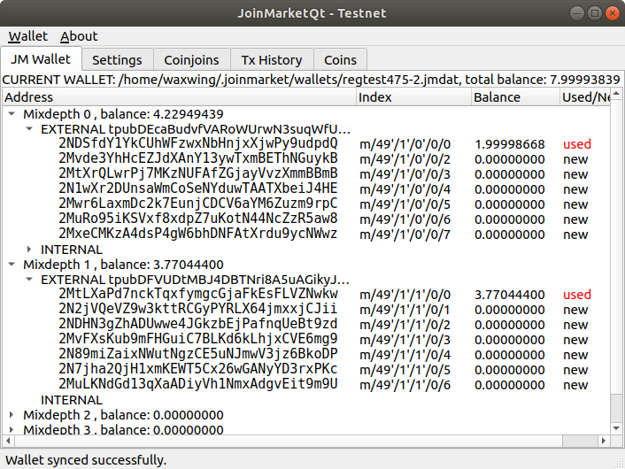

# Joinmarket

JoinMarket is software to create a special kind of bitcoin transaction called a CoinJoin transaction. Its aim is to improve the confidentiality and privacy of bitcoin transactions.

A CoinJoin transaction requires other people to take part. The right resources (coins) have to be in the right place, at the right time, in the right quantity. This isn't a software or tech problem, it's an economic problem. JoinMarket works by creating a new kind of market that would allocate these resources in the best way.

One group of participants (called market makers) will always be available to take part in CoinJoins at any time. Other participants (called market takers) can create a CoinJoin at any time. The takers pay a fee which incentivizes the makers. A form of smart contract is created, meaning the private keys will never be broadcasted outside of your computer, resulting in virtually zero risk of loss (aside from malware or bugs). As a result of free-market forces the fees will eventually be next to nothing.

Widespread use of JoinMarket improves bitcoin's fungibility and privacy. This implementation of JoinMarket also implements [PayJoin](https://en.bitcoin.it/wiki/PayJoin).

For a quick introduction to Joinmarket you can watch [this demonstration](https://youtu.be/hwmvZVQ4C4M) of installation and usage given by [Adam Gibson](https://github.com/AdamISZ) during the [Understanding Bitcoin conference](https://understandingbtc.com/) on April 6 2019.

### Wallet features

* Segwit addresses (native bech32 ('bc1') by default; p2sh wrapped ('3') optionally).
* Multiple "mixdepths" or pockets (by default 5) for better coin isolation
* Ability to spend directly, or with coinjoin; export private keys; BIP84/49 compatible seed (Trezor, Samourai etc.) and mnemonic extension option
* Fine-grained control over bitcoin transaction fees
* Basic coin control - can freeze individual utxos to stop them being spent in any transaction
* Can run sequence of coinjoins in automated form, either auto-generated (see `tumbler.py`) or self-generated sequence.
* Can specify exact amount of coinjoin (figures from 0.01 to 30.0 btc and higher are practical), can choose time and number of counterparties
* Can run passively to receive small payouts for taking part in coinjoins (see "Maker" and "yield-generator" in docs)
* GUI to support Taker role, including tumbler/automated coinjoin sequence.
* PayJoin - [BIP78](https://github.com/bitcoin/bips/blob/master/bip-0078.mediawiki) to pay users of other wallets (e.g. merchants), as well as between two compatible wallet users (Joinmarket, Wasabi, others). This is a way to boost fungibility/privacy while paying.
* Protection from [forced address reuse](https://en.bitcoin.it/wiki/Privacy#Forced_address_reuse) attacks.

### Community

+ IRC: `#joinmarket` on [irc.libera.chat](https://kiwiirc.com/nextclient/irc.libera.chat#joinmarket) ([logs](http://gnusha.org/joinmarket/))
+ IRC on tor: `#joinmarket` on the networks [Hackint](https://www.hackint.org/) and [Darkscience](https://www.darkscience.net/). These channels are bridged to the above freenode channel.

+ [Bitcoin wiki page](https://en.bitcoin.it/wiki/JoinMarket)

+ [Subreddit](https://reddit.com/r/joinmarket)

+ [Bitcointalk thread](https://bitcointalk.org/index.php?topic=919116.msg10096563)

+ [Twitter](https://twitter.com/joinmarket)

+ [Telegram](https://t.me/joinmarketorg)

### Support JoinMarket and bitcoin privacy

[Donate](https://bitcoinprivacy.me/joinmarket-donations) to help make JoinMarket even better.

JoinMarket is an open source project which does not have a funding model, fortunately the project itself has very low running costs as it is almost-fully decentralized and available to everyone for free. Developers contribute only as volunteers and donations are divided amongst them. Many developers have also been important in advocating for privacy and educating the wider bitcoin user base. Be part of the effort to improve bitcoin privacy and fungibility. Every donated coin helps us spend more time on JoinMarket instead of doing other stuff.
